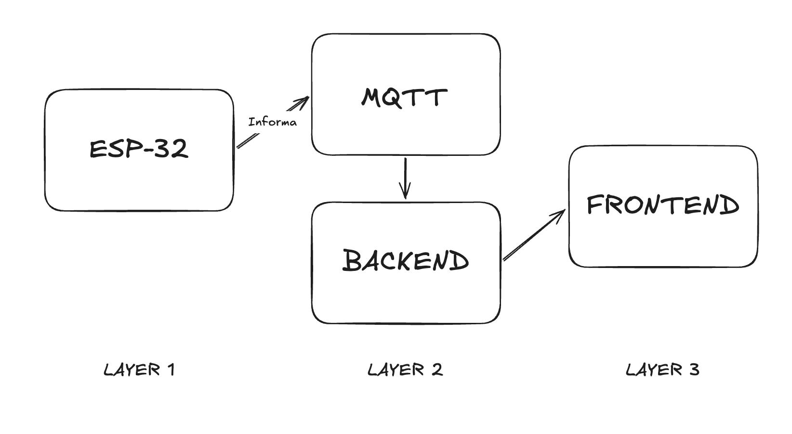
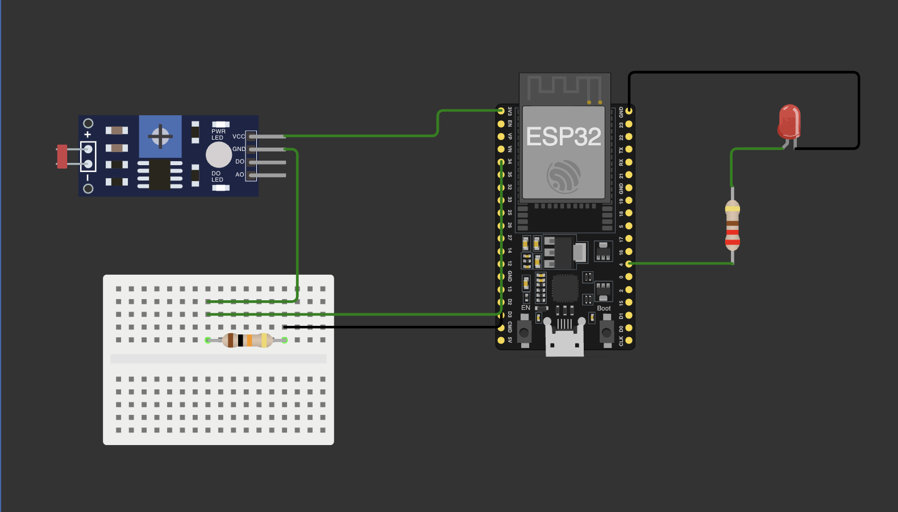

# Sistema IoT de Iluminação Inteligente
## Informações do Projeto
**Instituição:** Centro Universitário do Estado do Pará (CESUPA)  
**Disciplina:** Internet das Coisas (IoT)  
**Tipo:** Atividade Avaliativa  


## Descrição do Projeto
Este projeto implementa um sistema de iluminação inteligente que ajusta automaticamente o brilho de um LED baseado na luz ambiente. O sistema usa um sensor LDR para medir a luminosidade e controla um LED através de modulação PWM. Além do modo automático, é possível controlar manualmente o brilho através de uma interface web.
A arquitetura do sistema integra três componentes principais: um microcontrolador ESP32 que faz a leitura do sensor e controla o LED, um backend em Python que processa os dados e gerencia a comunicação MQTT, e um dashboard web que permite visualizar dados em tempo real e enviar comandos ao sistema.

### Objetivos do Projeto
- Demonstrar conceitos práticos de Internet das Coisas
- Implementar comunicação entre dispositivos usando protocolo MQTT
- Processar dados de sensores e controlar atuadores
- Criar interface web para monitoramento e controle
- Aplicar conhecimentos de sistemas embarcados e desenvolvimento web


## Arquitetura do Sistema


O sistema funciona em três camadas que se comunicam entre si. Na primeira camada, o ESP32 lê o sensor LDR a cada 100ms e controla o LED através de PWM. Ele publica esses dados via MQTT a cada 2 segundos e também recebe comandos de controle através de tópicos MQTT específicos.
Na segunda camada, o backend Python mantém uma conexão com o broker MQTT (Mosquitto) e armazena o estado mais recente do sistema. Ele oferece uma API REST que o frontend pode consultar via HTTP. Quando recebe comandos do frontend, traduz essas requisições HTTP em mensagens MQTT para o ESP32.
A terceira camada é o dashboard web que atualiza automaticamente a cada segundo, buscando novos dados do backend. Ele apresenta gráficos interativos mostrando o histórico das leituras e oferece controles para alternar entre modo automático/manual e ajustar o brilho.

### Fluxo de Comunicação
**Leitura de dados:**
1. ESP32 lê o sensor LDR
2. ESP32 publica valor via MQTT
3. Backend recebe e armazena o valor
4. Dashboard requisita dados via HTTP
5. Backend responde com os dados armazenados
6. Dashboard atualiza a interface
**Envio de comandos:**
1. Usuário interage com o dashboard
2. Dashboard envia requisição HTTP ao backend
3. Backend valida e publica comando via MQTT
4. ESP32 recebe o comando
5. ESP32 executa a ação (muda modo ou ajusta LED)


## Componentes e Materiais
### Hardware Necessário
| Componente | Quantidade | Descrição |
|------------|-----------|-----------|
| ESP32 DevKit | 1 | Microcontrolador com Wi-Fi integrado |
| Sensor LDR | 1 | Fotoresistor modelo GL5528 ou similar |
| LED | 1 | Qualquer cor (recomendado: branco) |
| Resistor 10kΩ | 1 | Para divisor de tensão com o LDR |
| Resistor 220Ω | 1 | Para limitar corrente do LED |
| Protoboard | 1 | Para montagem do circuito |
| Jumpers | Diversos | Fios para conexões |
| Cabo USB | 1 | Para programação e alimentação |

### Software Necessário
**No computador:**
- Python 3.8 ou superior
- Broker MQTT Mosquitto
- Arduino IDE 1.8+ ou 2.x
- Bibliotecas Python (listadas em requirements.txt)
**Para o ESP32:**
- Biblioteca WiFi (inclusa no pacote ESP32)
- Biblioteca PubSubClient (para MQTT)


## Montagem do Circuito
### Conexões do Circuito


O circuito possui duas partes principais. A primeira é o sensor LDR que forma um divisor de tensão com um resistor fixo. A segunda é o LED controlado por PWM através de um resistor limitador de corrente.

**Circuito do Sensor LDR:**
O LDR é conectado entre 3.3V e o GPIO 34, com um resistor de 10kΩ entre o GPIO 34 e GND. Esta configuração cria um divisor de tensão onde a tensão no GPIO 34 varia conforme a resistência do LDR muda com a luz. Em ambientes claros, o LDR tem baixa resistência e a tensão fica alta. Em ambientes escuros, o LDR tem alta resistência e a tensão fica baixa.
- Terminal 1 do LDR → 3.3V do ESP32
- Terminal 2 do LDR → GPIO 34 e resistor 10kΩ
- Outra ponta do resistor 10kΩ → GND
**Circuito do LED:**
O LED é controlado pelo GPIO 4 através de PWM. Um resistor de 220Ω limita a corrente para proteger tanto o LED quanto o pino do ESP32.
- GPIO 4 → Resistor 220Ω
- Resistor 220Ω → Anodo do LED (perna mais longa)
- Catodo do LED (perna mais curta) → GND

### Passo a Passo da Montagem
**1. Preparação:**
- Posicione o ESP32 na protoboard
- Identifique os pinos 3.3V, GND, GPIO 34 e GPIO 4
- Separe os componentes necessários

**2. Montagem do sensor LDR:**
- Conecte um terminal do LDR ao 3.3V
- Conecte o outro terminal do LDR ao GPIO 34
- Conecte um resistor de 10kΩ entre GPIO 34 e GND
- Use jumpers para fazer as conexões

**3. Montagem do LED:**
- Identifique o anodo (perna longa) e catodo (perna curta) do LED
- Conecte GPIO 4 ao resistor de 220Ω
- Conecte o resistor ao anodo do LED
- Conecte o catodo do LED ao GND

**4. Verificação:**
- Confira todas as conexões antes de ligar
- Certifique-se que não há curtos-circuitos
- Verifique a polaridade do LED

### Configuração do Sensor
O sistema está configurado para usar a resolução completa do conversor analógico-digital do ESP32 (12 bits, valores de 0 a 4095). Não é necessário calibração manual, pois o código automaticamente mapeia toda a faixa do sensor:
- Leitura 0 (escuro total) → LED no brilho máximo (255)
- Leitura 4095 (luz máxima) → LED apagado (0)
O mapeamento é linear e automático entre esses extremos, funcionando para qualquer sensor LDR sem necessidade de ajustes.
**Processo de calibração:**
1. Conecte o ESP32 ao computador via USB
2. Abra o Monitor Serial da Arduino IDE (115200 baud)
3. O ESP32 mostrará os valores lidos do sensor
4. Atualize também no código do dashboard Python:

```python
def calcular_iluminacao_pct(ldr: int, ldr_claro=3500, ldr_escuro=800):
```


## Instalação e Configuração
### Preparação do Ambiente
**1. Estrutura de pastas:**
Crie uma pasta para o projeto e organize os arquivos:
```
iot-iluminacao/
├── backend/
│ ├── main.py
│ └── requirements.txt
├── dashboard/
│ └── app.py
└── firmware/
└── esp32_code.ino
```

**2. Instalar Python:**
Certifique-se que o Python 3.8 ou superior está instalado:
```bash
python --version
```

**3. Instalar Mosquitto:**
O Mosquitto é o broker MQTT que gerencia a comunicação entre os componentes.

- **Linux (Ubuntu/Debian):**
    ```bash
    sudo apt-get update
    sudo apt-get install mosquitto mosquitto-clients
    ```
- **macOS:**
    ```bash
    brew install mosquitto
    ```
- **Windows:**
  - Baixe o instalador em https://mosquitto.org/download/
  - Execute como Administrador
  - O serviço inicia automaticamente

**4. Instalar Arduino IDE:**
- Baixe em https://www.arduino.cc/en/software
- Instale seguindo as instruções do sistema operacional
- Abra a IDE após a instalação

### Configurar ESP32
- Abra Arduino IDE
- Vá em File → Preferences
- No campo "Sketch, vá em Include Library e selecione ESP32
- Após isso vá em tools e selecione a board ESP32 Dev Module e sua porta conectada.


### Instalação das bibliotecas
Crie um ambiente virtual via venv e instale o arquivo requirements.txt

``` bash
python -m venv .venv
.venv/source/activate
pip install -r requirements.txt
```

# Execução
Atualize no código:
``` cpp
const char* MQTT_BROKER = "192.168.1.100"; // Seu IP aqui
```
**Importante:** Não use "localhost" ou "127.0.0.1", pois o ESP32 precisa do IP real da rede.

### Terminal 1
O Mosquitto geralmente inicia automaticamente como serviço. Se não:
```bash
mosquitto -v
```
**Verificar se está rodando:**
- Você verá mensagens no terminal indicando que o broker iniciou
- A mensagem deve mostrar "listening on port 1883"
**Testar o broker:**
```bash
# Terminal 1
mosquitto_sub -h 127.0.0.1 -t "teste" -v
# Outro terminal - Publish
mosquitto_pub -h 127.0.0.1 -t "teste" -m "mensagem teste"
# O primeiro terminal deve mostrar: teste mensagem teste
```
### Terminal 2 - Conexão Backend-MQTT

```bash
cd iot-iluminacao/backend
uvicorn backend.py --host 127.0.0.1 --port 8000 --reload
```

### Terminal 3 - Frontend hosteado localmente
```bash
python frontend.py
# hosteado em 127.0.1:8050
```

